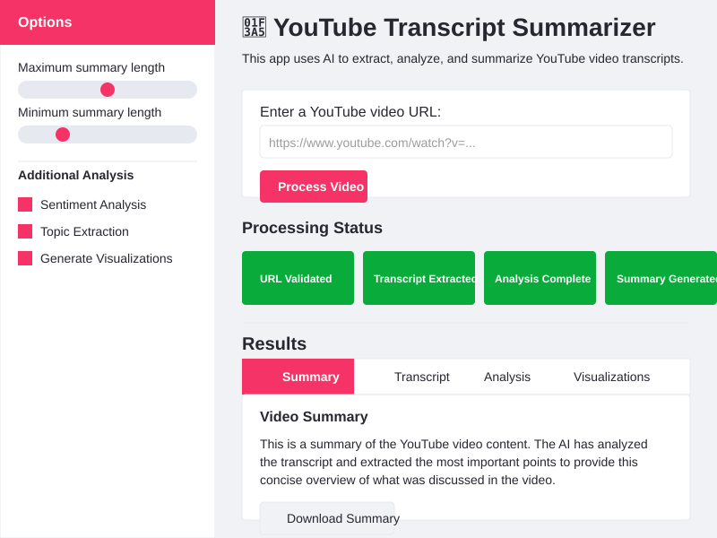

# YouTube Transcript Summarizer

An AI-powered application that transcribes, analyzes, and summarizes YouTube videos with a clean Streamlit interface.

## Features

- **Video Transcript Extraction**: Automatically pulls closed captions from YouTube videos
- **AI-Powered Summarization**: Generates concise summaries using BART transformer model
- **Intelligent Analysis**: Extracts key topics and performs sentiment analysis
- **Interactive Visualizations**: Displays keyword frequency and sentiment charts
- **Agentic Workflow**: Multi-stage processing with error handling and progress tracking

## Quick Start

1. **Install Dependencies**
   ```bash
   pip install streamlit youtube-transcript-api transformers nltk pandas plotly torch
   ```

2. **Run the Application**
   ```bash
   streamlit run youtube_summarizer_app.py
   ```

3. **Use the App**
   - Enter a YouTube URL in the input field
   - Adjust summary length and analysis options in the sidebar
   - Click "Process Video" to start
   - View results in the tabbed interface

## Requirements

- Python 3.7+
- Internet connection
- YouTube videos with available closed captions

## Limitations

- Only works with videos that have captions/transcripts
- Processing time varies based on video length
- First run may be slower due to model downloads


Built with ❤️ using Streamlit, Transformers, and NLTK
