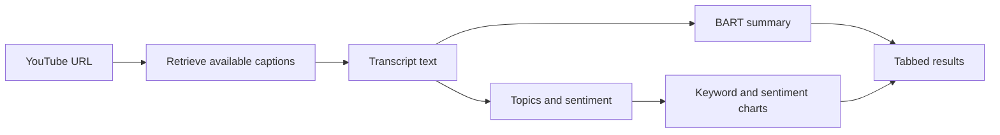

# YouTube Transcript Summarizer

### Turn captioned videos into summaries, topics, and visual insights

YouTube Transcript Summarizer is a Streamlit application for exploring the
spoken content of a video. Paste a YouTube URL, choose your summary and
analysis settings, and view the results in a tabbed interface.

The app **retrieves an available YouTube transcript**; it does not generate a
new transcript from the video's audio. Its summaries are produced with a BART
transformer model.

[Features](#features) · [How it works](#how-it-works) ·
[Quick start](#quick-start) · [Requirements](#requirements) ·
[Limitations](#limitations)

---

## Features

| Feature | What it provides |
| --- | --- |
| Transcript retrieval | Pulls available closed captions for a YouTube video |
| AI summary | Produces a shorter account of the transcript with BART |
| Topic analysis | Identifies prominent themes in the transcript |
| Sentiment analysis | Reports sentiment signals from the transcript text |
| Visualizations | Shows keyword frequency and sentiment charts |
| Processing feedback | Displays progress and handles errors across the workflow |

## How it works



The analysis reflects **text in the retrieved captions**. It cannot assess
visual scenes, music, tone of voice, or information omitted from the captions.

## Quick start

### 1. Install dependencies

Use a Python environment compatible with the installed library versions:

```bash
python -m pip install streamlit youtube-transcript-api transformers nltk pandas plotly torch
```

### 2. Launch the app

```bash
python -m streamlit run youtube_summarizer_app.py
```

Streamlit prints a local URL in the terminal. Open it in your browser.

### 3. Process a video

1. Enter a YouTube video URL.
2. Set summary length and analysis options in the sidebar.
3. Select **Process Video**.
4. Explore the transcript, summary, topics, and charts in the result tabs.

## Requirements

- An internet connection for transcript retrieval and the initial model
  download
- A YouTube video with captions or a transcript available to the app
- Enough local memory and processing capacity for the selected model and video
  length

## Limitations

| Situation | Expected behavior |
| --- | --- |
| No accessible captions | The app cannot summarize that video's audio |
| Long transcript | Processing can take longer |
| First run | The transformer model may need to download |
| Captions contain errors | Summary, topics, and sentiment can reflect those errors |

Summaries and sentiment are automated interpretations. For important details,
check the original video and transcript rather than relying on the generated
output alone.

## Built with

- [Streamlit](https://streamlit.io/) for the interface
- [Transformers](https://huggingface.co/docs/transformers/) and PyTorch for
  BART summarization
- [youtube-transcript-api](https://github.com/jdepoix/youtube-transcript-api)
  for transcript retrieval
- NLTK, Pandas, and Plotly for text analysis and charts
